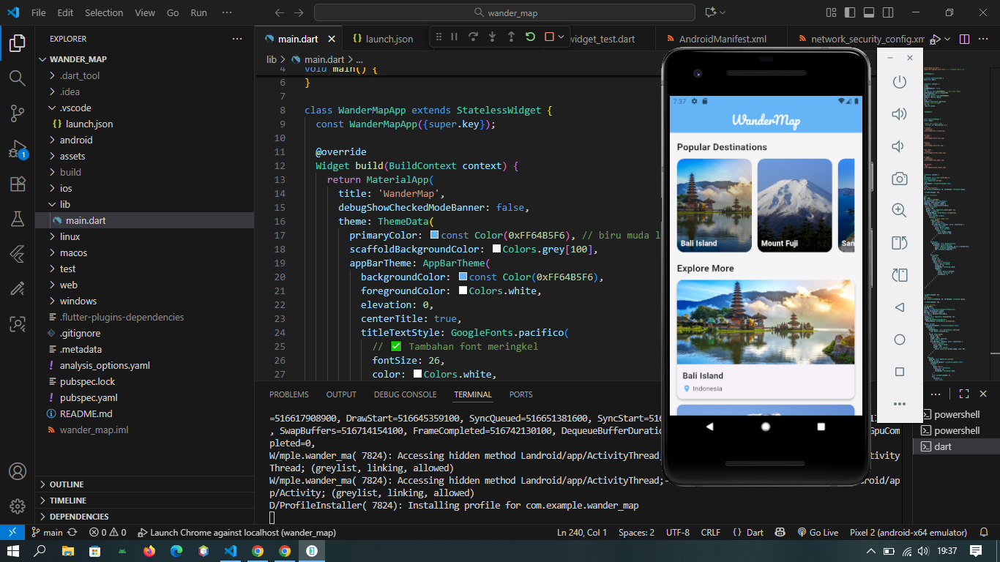
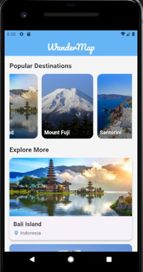
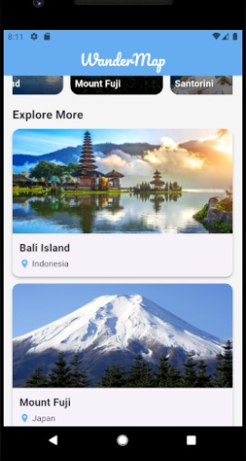

# 🌍 WanderMap

**WanderMap** adalah aplikasi Flutter bertema **wisata dunia** yang menampilkan daftar destinasi populer dengan tampilan visual menarik.  
Aplikasi ini dikembangkan menggunakan **Flutter** dan **Google Fonts** untuk tampilan yang lebih menarik.

> Tugas ini dibuat untuk memenuhi **eLearning (Session 5)**.

---

## ✨ Fitur Utama

- **Daftar destinasi wisata populer** (Bali Island, Mount Fuji, Santorini, dan lainnya)  
- **Tema kustom (themed app)** dengan warna biru lembut (`#64B5F6`)  
- **Font khusus "Pacifico"** dari Google Fonts untuk judul aplikasi  
- **Gambar lokal** dari folder `assets/images/`  
- Tampilan kartu (*Card UI*) untuk setiap destinasi  
- Responsif dan dapat di-scroll secara horizontal dan vertikal  

---

## 🖼️ Tampilan Aplikasi

Berikut hasil tampilan aplikasi saat dijalankan di emulator Android:

**Tampilan Utama**
---

**Daftar Destinasi**
---

**Tampilan Explore More**
---

---

## Konsep & Komponen Flutter yang Digunakan

| Komponen | Fungsi |
|-----------|--------|
| `MaterialApp` | Struktur utama aplikasi Flutter |
| `ThemeData` | Mengatur tema global (warna & font) |
| `AppBarTheme` | Menyesuaikan tampilan AppBar |
| `GoogleFonts.pacifico` | Menggunakan font khusus untuk judul |
| `ListView.builder` | Menampilkan daftar destinasi secara dinamis |
| `Card` dan `ClipRRect` | Menampilkan tampilan destinasi dengan sudut membulat |
| `Image.asset` | Menampilkan gambar lokal dari folder `assets/` |
| `LinearGradient` | Menambahkan efek gradasi pada gambar |

---

## Tools yang Digunakan

| Tool | Fungsi |
|------|----------------|
| **Flutter SDK** | Framework utama untuk membangun aplikasi lintas platform (Android, iOS, Windows). |
| **Dart SDK** | Bahasa pemrograman yang digunakan untuk menulis logika aplikasi Flutter. |
| **Visual Studio Code** | Editor kode yang digunakan untuk menulis, menjalankan, dan debug proyek. |
| **Android SDK & Emulator** | Digunakan untuk menjalankan dan menguji aplikasi Flutter di perangkat virtual. |
| **Git & GitHub** | Untuk versi kontrol dan membagikan proyek ke repository online. |
| **Google Fonts Package** | Menambahkan font khusus (`Pacifico`) agar tampilan teks lebih menarik. |
| **Assets (Gambar Lokal)** | Menyimpan file gambar destinasi di folder `assets/images/`. |
| **Flutter CLI (Command Line Tools)** | Menjalankan perintah seperti `flutter run`, `flutter build`, dan `flutter pub get`. |

---

- **Nama**: Lita Alentina  
- **NIM**: 23552011097  
- **Kelas**: TIF K 23B

